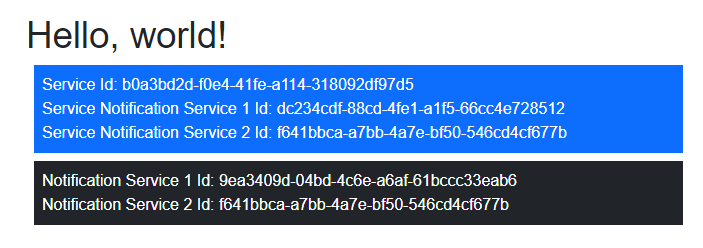

# Blazor's OwningComponentBase - The Good and the Bad

`OwningComponentBase` is a Blazor component with it's Dependancy Injection Container.  It's purpose is to provide a finer level of control over scoped and transient services than the SPA level container.

In this article I'll look at how to use it and manage the side effects inherent in it's use.

To quote the Microsoft documentation:

> Use the OwningComponentBase class as a base class to author components that control the lifetime of a service provider scope. This is useful when using a transient or scoped service that requires disposal such as a repository or database abstraction. Using OwningComponentBase as a base class ensures that the service provider scope is disposed with the component.

Sounds great, but few people use it because either they don't know about it or have tried it and caught out by side effects.

I'll use some demo services and a demo page to demonstrate what is going on.

## Test Services

For the demonstration

A single Transient service class that shows the basic structure of the test services.

```csharp
public class TransientService : IDisposable
{
    public Guid Uid = Guid.NewGuid();
    public TransientService()
        => Debug.WriteLine($"{this.GetType().Name} - created instance: {Uid}");
    public void Dispose()
        => Debug.WriteLine($"{this.GetType().Name} - Disposed instance: {Uid}");
}
```

Two Notification Services:

```csharp
public class NotificationService1 : IDisposable
{
    public Guid Uid = Guid.NewGuid();
    public NotificationService1()
        => Debug.WriteLine($"{this.GetType().Name} - created instance: {Uid}");
    public void Dispose()
        => Debug.WriteLine($"{this.GetType().Name} - Disposed instance: {Uid}");
}
```
```csharp
public class NotificationService2 : IDisposable
{
    public Guid Uid = Guid.NewGuid();
    public NotificationService2()
        => Debug.WriteLine($"{this.GetType().Name} - created instance: {Uid}");
    public void Dispose()
        => Debug.WriteLine($"{this.GetType().Name} - Disposed instance: {Uid}");
}
```

And a View Service

```csharp
public class ViewService : IDisposable
{
    public Guid Uid = Guid.NewGuid();
    public NotificationService1? NotificationService1 = default!;
    public NotificationService2? NotificationService2 = default!;
    public TransientService? TransientService = default!;

    public ViewService(NotificationService1 notificationService1, TransientService transientService)
    {
        Debug.WriteLine($"{this.GetType().Name} - created instance: {Uid}");
        NotificationService1 = notificationService1;
        Debug.WriteLine($"{this.GetType().Name} - {NotificationService1.GetType().Name} instance: {NotificationService1.Uid}");
        TransientService = transientService;
        Debug.WriteLine($"{this.GetType().Name} - {TransientService.GetType().Name} instance: {TransientService.Uid}");
    }

    public void SetParentServices(IServiceProvider serviceProvider)
    {
        NotificationService2 = serviceProvider.GetService<NotificationService2>();
        Debug.WriteLine($"{this.GetType().Name} - {NotificationService2?.GetType().Name} instance: {NotificationService2?.Uid ?? Guid.Empty}");
    }

    public void Dispose()
        => Debug.WriteLine($"{this.GetType().Name} - Disposed instance: {Uid}");
}
```

These are registered as follows:

```csharp
builder.Services.AddScoped<ViewService>();
builder.Services.AddScoped<NotificationService1>();
builder.Services.AddScoped<NotificationService2>();
builder.Services.AddTransient<TransientService>();
```

## Test Page

```csharp
@page "/"

@inherits OwningComponentBase<ViewService>

@inject NotificationService1 NotificationService1
@inject NotificationService2 NotificationService2
@inject TransientService TransientService
@inject IServiceProvider ServiceProvider

<PageTitle>Index</PageTitle>

<h1>Hello, world!</h1>

<div class="bg-primary text-white m-2 p-2">
    <div>
        Service Id: @Service.Uid
    </div>
    <div>
        Service Notification Service 1 Id: @Service.NotificationService1?.Uid
    </div>
    <div>
        Service Notification Service 2 Id: @Service.NotificationService2?.Uid
    </div>
</div>

<div class="bg-dark text-white m-2 p-2">
    <div>
        Notification Service 1 Id: @NotificationService1.Uid
    </div>
    <div>
        Notification Service 2 Id: @NotificationService2.Uid
    </div>
</div>

@code {
    protected override void OnInitialized()
        => Service.SetParentServices(ServiceProvider);
}
```


## Outputs

Initial load of page:

```text
TransientService - created instance: e6aeae46-2a79-4e70-a57e-8eb49098e1cb
NotificationService2 - created instance: 37939d39-7015-49cb-8bf2-8fa5dc8bc0d8
NotificationService1 - created instance: 606ecce6-b713-4378-969d-62ca7a35b6f2
NotificationService1 - created instance: c2fa5b6b-d0ba-4628-a89d-5e2264466056
TransientService - created instance: cdabc826-0aa1-4398-a398-21a01b896c7d
ViewService - created instance: c69af42d-cd50-4e3e-8747-2c36a72df050
ViewService - NotificationService1 instance: c2fa5b6b-d0ba-4628-a89d-5e2264466056
ViewService - TransientService instance: cdabc826-0aa1-4398-a398-21a01b896c7d
ViewService - NotificationService2 instance: 37939d39-7015-49cb-8bf2-8fa5dc8bc0d8
```

Navigate away:

```text
ViewService - Disposed instance: c69af42d-cd50-4e3e-8747-2c36a72df050
TransientService - Disposed instance: cdabc826-0aa1-4398-a398-21a01b896c7d
NotificationService1 - Disposed instance: c2fa5b6b-d0ba-4628-a89d-5e2264466056
```

And return:

```text
TransientService - created instance: 7f85140d-3011-4540-bcf0-19f0b4a966e1
NotificationService1 - created instance: 6f22deaf-bdad-42d3-bd6c-2f5452a723ab
TransientService - created instance: 970a22ba-3401-43c2-b998-c892d1bc9fab
ViewService - created instance: b941d4cc-9668-44e0-b390-accaf0b54987
ViewService - NotificationService1 instance: 6f22deaf-bdad-42d3-bd6c-2f5452a723ab
ViewService - TransientService instance: 970a22ba-3401-43c2-b998-c892d1bc9fab
ViewService - NotificationService2 instance: 37939d39-7015-49cb-8bf2-8fa5dc8bc0d8
The thread 0xaa4 has exited with code 0 (0x0).
The thread 0x5308 has exited with code 0 (0x0).
The thread 0xb40 has exited with code 0 (0x0).
```

and away

