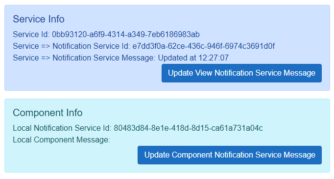
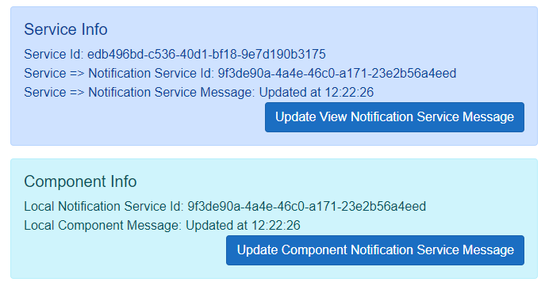

# Using Blazor's OwningComponentBase

`OwningComponentBase` is a Blazor component with it's own Dependancy Injection container.  It's purpose is to provide a finer level of control over scoped and transient services than the SPA level container.

In this article I'll look in some depth at how to use it.  It has it's foibles and there are some issues inherent in it's design.

To quote the Microsoft documentation:

> Use the OwningComponentBase class as a base class to author components that control the lifetime of a service provider scope. This is useful when using a transient or scoped service that requires disposal such as a repository or database abstraction. Using OwningComponentBase as a base class ensures that the service provider scope is disposed with the component.

Sounds great, but few people use it.  I don't know whether that's because they don't know about it, think it's too difficult to use or have tried it and been caught out by it's issues.

`OwningComponentBase` comes in two guises.

1. `OwningComponentBase` where you manually setup and use any services you want in the component DI service container.
2. `OwningComponentBase<TService>` where `TService` is added to the container and provided as `Service`.  You can still add an other services manually. 

I'm not going to regurgitate the same old information on basic usage.  You can get from the Microsoft documents and several articles and videos.

- [Information on Dependency Injection](https://docs.microsoft.com/en-us/aspnet/core/blazor/fundamentals/dependency-injection?view=aspnetcore-6.0)
- [Specific information on OwningComponentBase](https://docs.microsoft.com/en-us/aspnet/core/blazor/fundamentals/dependency-injection?view=aspnetcore-6.0#utility-base-component-classes-to-manage-a-di-scope)

## Repository

This repository for this article is [here - Blazr.OwningComponentBase](https://github.com/ShaunCurtis/Blazr.OwningComponentBase).

## Nomenclature

It's very easy to get confused on nomenclature in Blazor.

- **DI** is short for Dependency Injection
- **Component DI Container** is the DI container associated with the `OwningComponentBase` implementing component - normally the *Page* (another confusing term).
- **SPA DI Container** is the DI Container associated with the current Single Page Application instance running in the browser Tab.  Note **F5** will close and reinitialize the SPA DI Container.  Each browser tab has a separate SPA DI Container.
- **Application DI Container** is the top level DI instance where all the *Singleton* instances run.  There's only one of these and it lives for the lifetime of the application instance.

## A Typical Scenario

We have a UI form that displays a list of members in our club.  It uses a view service connected to a data pipeline to manage the list and a notification service to notify live forms if the underlying data changes: perhaps an edit or delete in a modal dialog.  The UI form is used in serveral contexts on the site: lists of members booked in for sessions, unpaid members,... , so we don't want a single scoped view service.

There are two approaches:

1. Set the form to inherit from `OwningComponentBase` and use the built-in DI service container.
2. Make the view service a transient service, creating an instance each time we use the form.

Some test services and a test page to look at the two options.

## Test Services

A Transient Service class.

```csharp
public class TransientService : IDisposable
{
    public Guid Uid = Guid.NewGuid();
    public TransientService() => Debug.WriteLine($"{this.GetType().Name} - created instance: {Uid}");
    public virtual void Dispose() => Debug.WriteLine($"{this.GetType().Name} - Disposed instance: {Uid}");
}
```

A Notification Service that implements a basic notification pattern.

```csharp
public class NotificationService : IDisposable
{
    public Guid Uid = Guid.NewGuid();
    public event EventHandler? Updated;
    public string Message { get; private set; } = string.Empty;

    public NotificationService() => Debug.WriteLine($"{this.GetType().Name} - created instance: {Uid}");

    public void Dispose() => Debug.WriteLine($"{this.GetType().Name} - Disposed instance: {Uid}");

    public void NotifyChanged()
    {
        this.Message = $"Updated at {DateTime.Now.ToLongTimeString()}";
        this.Updated?.Invoke(this, EventArgs.Empty);
    }
}
```

And a View Service that uses these two services.

```csharp
using System.Diagnostics;

namespace Blazr.OwningComponentBase.Data;

public class ViewService : IDisposable
{
    public Guid Uid = Guid.NewGuid();
    public NotificationService NotificationService;
    public TransientService TransientService;

    public ViewService(NotificationService notificationService, TransientService transientService)
    {
        Debug.WriteLine($"{this.GetType().Name} - created instance: {Uid}");
        NotificationService = notificationService;
        TransientService = transientService;
    }

    public void UpdateView()
        => NotificationService.NotifyChanged();

    public void Dispose()
        => Debug.WriteLine($"{this.GetType().Name} - Disposed instance: {Uid}");
}
```

These are registered in the application services container as follows:

```csharp
builder.Services.AddScoped<ViewService>();
builder.Services.AddScoped<NotificationService>();
builder.Services.AddTransient<TransientService>();
```

## The Instance Issue

A test page to demonstrate this.  It inherits from `OwningComponentBase<TService>`.

```csharp
@page "/"

@inherits OwningComponentBase<ViewService>
@implements IDisposable

@inject NotificationService NotificationService

<h1>OwningComponentBase Test 1</h1>

<div class="alert alert-primary">
    <h5>Service Info</h5>
    <div>
        Service Id: @Service.Uid
    </div>
    <div>
        Service => Notification Service Id: @Service.NotificationService?.Uid
    </div>
    <div>
        Service => Notification Service Message: @Service.NotificationService?.Message
    </div>
    <div class="text-end">
        <button class="btn btn-primary" @onclick=this.UpdateView>Update View Notification Service Message</button>
    </div>
</div>

<div class="alert alert-info">
    <h5>Component Info</h5>
    <div>
        Local Notification Service Id: @NotificationService.Uid
    </div>
    <div>
        Local Component Message:  @NotificationService.Message
    </div>
    <div class="text-end">
        <button class="btn btn-primary" @onclick=this.UpdateLocal>Update Component Notification Service Message</button>
    </div>
</div>

@code {
    protected override void OnInitialized()
        => NotificationService.Updated += this.OnUpdate;

    private void OnUpdate(object? sender, EventArgs e)
        => this.InvokeAsync(StateHasChanged);

    private void UpdateView()
        => Service.UpdateView();

    private void UpdateLocal()
        => NotificationService.NotifyChanged();

    protected override void Dispose(bool disposing)
    {
        NotificationService.Updated -= this.OnUpdate;
        base.Dispose(disposing);
    }
}
```

When you run the solution, the page looks like this:



Check the Guids on the `NotificationService` instances: there are two and therefore two active instances of the service.

The `ViewService` instance is created in the component DI container.  It defines a `NotificationService` in its constructor. The component DI container gets the service definition from the application level service factory. Seeing it's a scoped service, it checks for it's own current instance, finds none, so creates one.

The test page injects `NotificationService`. This request is handled during page creation by the SPA container which supplies it's instance.  It's different from that in the (soon to be created) component DI service container.

If the ViewService raises a notification on `NotificationService`, it raises it on the component DI instance, not the SPA DI instance.  And visa-versa, it doesn't receive any notifications from the SPA instance as it's registered a handler on the component instance. 

I'm sure many programmers stumble at this hurdle and give up.

### Fixing the Instance Issue

The key to fixing it is:
1. A good understanding of DI fundimentals.
2. Understanding which services instances you need to inject.

#### View Service Changes

Change `NotificationService` to a property with some exception checking to ensure we don't use a service before it's set.

```csharp
    private NotificationService? _notificationService;
    public NotificationService NotificationService
    {
        get
        {
            if (_notificationService is null)
                throw new InvalidOperationException("No service is registered.  You must run SetParentServices before using the service.");

            return _notificationService!;
        }
    }
```

Update the constructor to remove `NotificationService` injection.

```csharp
public ViewService(TransientService transientService)
{
    Debug.WriteLine($"{this.GetType().Name} - created instance: {Uid}");
    TransientService = transientService;
}
```

Add a `SetServices` method.  This gets the `NotificationService` from the supplied `IServiceProvider` instance.

We call this method from the component and pass in the SPA DI Service Provider.  If we don't, we get the exception we just coded the first time we try to use it!

```csharp
public void SetServices(IServiceProvider serviceProvider)
    => _notificationService = serviceProvider.GetService<NotificationService>();
```

#### Changes to Test.razor

Inject the SPA service provider.

```csharp
@inject IServiceProvider SpaServiceProvider
```

And call `SetServices` on `Service` in `OnInitialized`.

```csharp
    protected override void OnInitialized()
    {
        Service.SetServices(SpaServiceProvider);
        NotificationService.Updated += this.OnUpdate;
    }
```



Now we see that everyone is using the same DI instance of `NotificationService`.  The Guid's are the same and the notifications are working correctly.

### The Disposal Issue

The DI container maintains a reference to all objects it creates that implement `IDisposable` or `IAsyncDisposable`.  It does so to run *Dispose* on such objects when the container itself is disposed.  The garbage collector doesn't destroy such objects because they are still referenced (by the container).  Dispose Transient objects start collecting up, causing a memory leak until the SPA session ends.

You can see the problem in our test.  Here's the log of service creations and disposals.  Look at the `TransientService` entries.  Transient Service `4984252f` is disposed when we exit the page because it's the service in the component DI container.  Transient Service `333012f6` is created in the SPA DI container by the page and doesn't get disposed.  On the next visit to the page another instance is created.  

```text
// First Load

Page => TransientService - created instance: 333012f6-452b-4105-9372-a67fb45c5b16
Page => NotificationService - created instance: 03817ba1-4dc1-4f62-b111-d1a8ceb28aac
OCB => TransientService - created instance: 4984252f-2308-4feb-b64c-4df34bc4688d
Page => ViewService - created instance: dfb929fc-3d54-4d42-a501-77be735d61c0

// Exit Page

Page => ViewService - Disposed instance: dfb929fc-3d54-4d42-a501-77be735d61c0
OCB => TransientService - Disposed instance: 4984252f-2308-4feb-b64c-4df34bc4688d

// Back to Page

Page => TransientService - created instance: 07bf1685-24b3-4714-8ecc-f9c82d6cc4ca
OCB => TransientService - created instance: 11f35c6f-7cf1-420a-9bf3-90f29108d8e3
Page => ViewService - created instance: f1451c57-9c87-4924-b171-f0fcbd7b5741

// Exit Page

Page => ViewService - Disposed instance: f1451c57-9c87-4924-b171-f0fcbd7b5741
OCB => TransientService - Disposed instance: 11f35c6f-7cf1-420a-9bf3-90f29108d8e3
```

The general rule is therefore to never implement `IDisposable` or `IAsyncDisposable` or any features that require disposing in Transient services.  As almost **ALL** database activity requires some form of managed disposal, it's prudent to never do anything assocaited with databases in Transient services.

As you've seen above, there is a way around this using `OwningComponentBase` and it's short lived DI container.  In the code above the Transient Service is disposed every time we leave the page.

However, I would caution against implementing services in this way.  It's too easy to accidently start using such a service in the main SPA container.  It far better to set up the service as `Scoped` and then only use it in `OwningComponentBase`.

### The Dispose Issue

In the test page we've hooked up an Event Handler that we need to detach on disposal.

```csharp
    public void Dispose()
        =>  NotificationService.Updated -= this.OnUpdate;
```

This *hides* the `OwningComponentBase` implementation which consequently never gets run.  It contains some rather important code to dispose the DI Container.

```csharp
void IDisposable.Dispose()
{
    if (!IsDisposed)
    {
        _scope?.Dispose();
        _scope = null;
        Dispose(disposing: true);
        IsDisposed = true;
    }
}
```
The correct way is to override `Dispose(bool disposing)`.

```csharp
protected override void Dispose(bool disposing)
{
    NotificationService.Updated -= this.OnUpdate;
    base.Dispose(disposing);
}
```

## Summary

`OwningComponentBase` is a good tool to have in your toolbox.  You just need to know how to deploy it.

Some rules/guidelines:

1. Ensure you understand which instances of DI services you want to use.
2. Use Guids and logging to track instance creation/disposal during development.  It can be very enlightening!
3. Transient services should never implement or need to implement disposal.
4. Override `Dispose(bool disposing)` when inheriting `OwningComponentBase`, never `Dispose()`.

